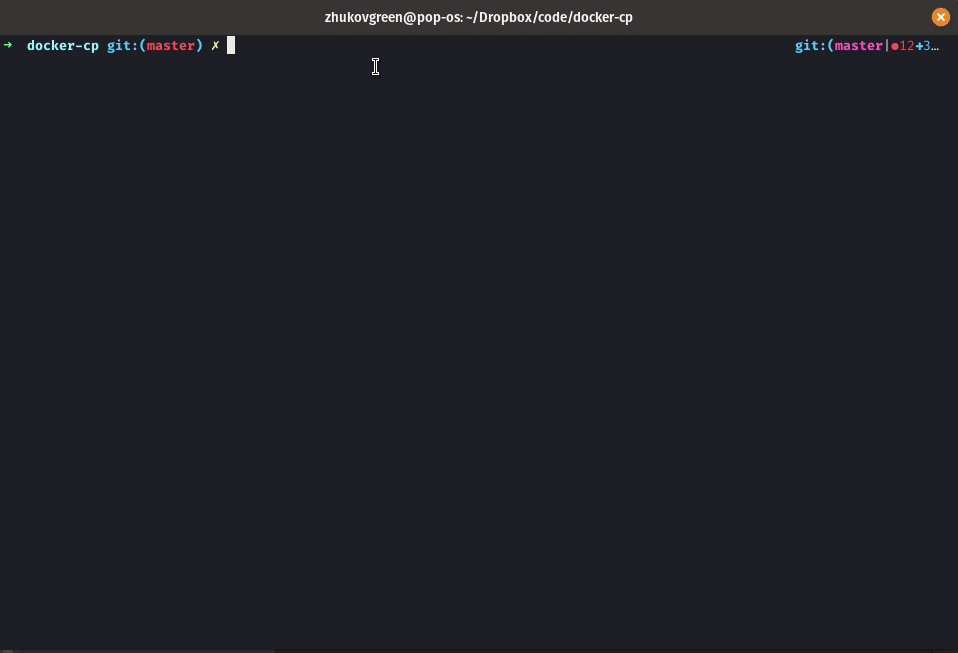

# CLI utility for copying files to and from the docker

```
Usage: docker-cp [OPTIONS] SRC TARGET

  Simple docker cp implementation.

  Copying files from SRC to TARGET. Path for a container defined like:
  {container_name}:{container_path}

  Examples:

      * docker-cp test:/etc/fedora-release .

      * docker-cp ./pyproject.toml test/tmp/

Options:
  -b, --buffer-length INTEGER  Buffer size  [default: 1]
  -v, --verbose                Verbosity of the tool
  --help                       Show this message and exit.
```



# Installation

1. git clone https://github.com/ZhukovGreen/docker-cp.git
2. pip install poetry
3. poetry install
4. poetry shell

Now utility available at `docker-cp --help`

# Development
1. docker run -d --name test fedora:25 /usr/bin/sleep
2. git clone https://github.com/ZhukovGreen/docker-cp.git
3. pip install poetry
4. poetry install
5. poetry run pytest
